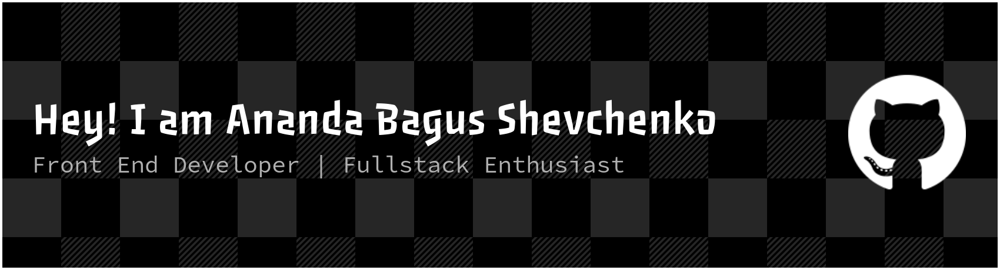

## Hi!, I am Ananda Bagus Shevchenko👋

## Programming Languages & Tools

## Connect With Me
 

## GitHub Stats:

##
<picture>
  <source media="(prefers-color-scheme: dark)" srcset="https://raw.githubusercontent.com/bguss03/bguss03/output/pacman-contribution-graph-dark.svg">
  <source media="(prefers-color-scheme: light)" srcset="https://raw.githubusercontent.com/bguss03/bguss03/output/pacman-contribution-graph.svg">
  
</picture>

###

